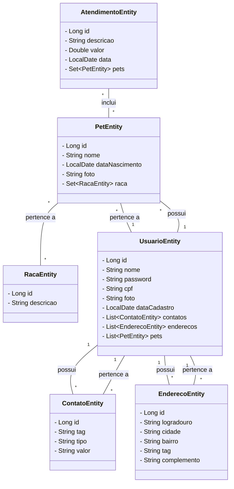

# sistema-controle-atendimento-petshop

## Introdução

A solução envolve a criação de dois microsserviços, um desenvolvido em **Spring** utlizando banco de dados **H2** para persistir as informações do pet shop através de autenticação JWT e outro microfrontend construído em **Angular** para o usuário interagir com o sistema de controle de atendimentos através de um dashboard 100% funcional melhorado em questão de UI/UX com a implementação da biblioteca Bootstrap para deixar o design e layout mais sofisticado.

No microsserviço back-end há uma documentação da API com todos os endpoints da aplicação, porém dentro da documentação a opção de adicionar a autenticação JWT para o usuário colocar seu token antes de executar a requisição não funcionou conforme esperado, portanto recomendo utilizar alguma ferramenta semelhante ao Swagger como **Postman** ou **Insomnia** para testar os endpoints com base na documentação.

No microfrontend _tem a opção de adicionar a foto do usuário e dos pets do cliente, melhorando a identificação dos usuários e pets e podendo atualizá-las a qualquer momento adicionando uma nova ou removendo a existente_.

## Banco de Dados (DER - Diagrama Entidade-Relacionamento)

<p align="center">
  <br>
  <sup>Modelo final do banco de dados construído para esse projeto</sup>
</p>

## Relacionamentos entre entidades (JPA)



## Instruções de uso

Para construir todos os microsserviços desse projeto, _basta clonar esse repositório_ e utilizar o **Docker** _abrindo esse projeto no terminal de sua escolha e executando o comando_:

```bash
docker-compose up -d
```

Após a construção e subida de todo esse projeto para o seu Docker local poderá abrir as aplicações nos links abaixo:

- [Front-end (Angular)](http://localhost:4200/)
- [Back-end (Spring)](http://localhost:8080/) => direciona para a documentação da API

Também há a opção de abrir esse projeto no **IDX**, _um novo ambiente cloud de desenvolvimento do Google no qual utilizei para construir todo esse projeto (back-end e front-end)_.


Colocar a URL deste repositório e criar um novo espaço de trabalho em nuvem em `Import`.<br>
_Se tiver conta no Google será mais fácil de acessar esse projeto, não precisando clonar o repositório acima e subindo-o no Docker localmente._

Neste projeto o ambiente em nuvem do Google já está todo configurado para executar o front-end e o back-end, **acessando-os a partir dos guias abaixo:**

<br>


> Se decidir acessar esse projeto pelo IDX, **na documentação da API tem outros links para acessar os testes unitários** _(visualizar as instruções de teste abaixo antes de acessar a cobertura dos serviços)_

## Testes Unitários

Abra este repositório na sua máquina local ou no ambiente IDX e rode os comandos **para ...**

- **... para** rodar os testes unitários do front-end:

  ```bash
  cd controle-atendimento-petshop-web && npm test  # ou npm run test
  ```

  


- **... para** rodar os testes unitários do back-end:

  ```bash
  cd controle-atendimento-petshop-service && ./mvnw clean package
  ```

  

<br>

> _Se tiver avaliando esse projeto dentro do IDX, na documentação da API tem os links para acessar o percentual de cobertura dos testes_ **(não funciona no Docker)**:
>
> 
> <br>
> ### Front-end (Angular):
>
> 
>
> <br>
>
> ### Back-end (Spring):
>
> 

<br>

## Visualização (Resultados)

<p align="center">
  <br>
  <sup>Tela de Login</sup>
</p>
<br>
<p align="center">
  <br>
    <sup>Tela de Cadastro (Funcionário)</sup>
</p>
<br>
<p align="center">
  <br>
  <sup>Tela de Atualização (Cliente)</sup>
</p>
<br>
<p align="center">
  <br>
  <br>
  <br>
  <sup>Tela de Criação de Atendimento (Funcionário)</sup>
</p>
<br><br>

Espero que tenham gostado! Qualquer dúvida é só me contatar por email.<br>
Um forte abraço!!! 😊🫂🧑🏻‍💻
