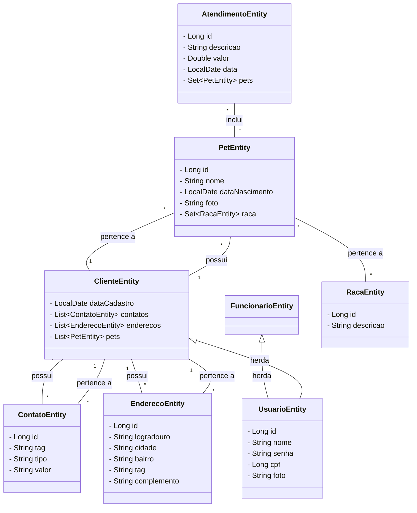

# Getting Started

### Relacionamentos entre entidades (JPA)

```mermaid
classDiagram
    %% Definindo classes
    class AtendimentoEntity {
        - Long id
        - String descricao
        - Double valor
        - LocalDate data
        - Set~PetEntity~ pets
    }

    class ClienteEntity {
        - LocalDate dataCadastro
        - List~ContatoEntity~ contatos
        - List~EnderecoEntity~ enderecos
        - List~PetEntity~ pets
    }

    class ContatoEntity {
        - Long id
        - String tag
        - String tipo
        - String valor
    }

    class EnderecoEntity {
        - Long id
        - String logradouro
        - String cidade
        - String bairro
        - String tag
        - String complemento
    }

    class FuncionarioEntity {
        
    }

    class PetEntity {
        - Long id
        - String nome
        - LocalDate dataNascimento
        - String foto
        - Set~RacaEntity~ raca
    }

    class RacaEntity {
        - Long id
        - String descricao
    }

    class UsuarioEntity {
        - Long id
        - String nome
        - String senha
        - Long cpf
        - String foto
    }

    %% Relacionamentos
    ClienteEntity "1" -- "*" ContatoEntity : possui
    ClienteEntity "1" -- "*" EnderecoEntity : possui
    ClienteEntity "1" -- "*" PetEntity : possui
    PetEntity "*" -- "*" RacaEntity : pertence a
    AtendimentoEntity "*" -- "*" PetEntity : inclui
    ContatoEntity "*" -- "1" ClienteEntity : pertence a
    EnderecoEntity "*" -- "1" ClienteEntity : pertence a
    PetEntity "*" -- "1" ClienteEntity : pertence a

    FuncionarioEntity <|-- UsuarioEntity : herda
    ClienteEntity <|-- UsuarioEntity : herda
```